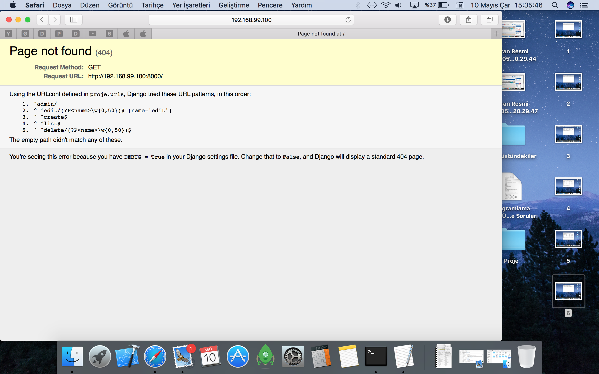
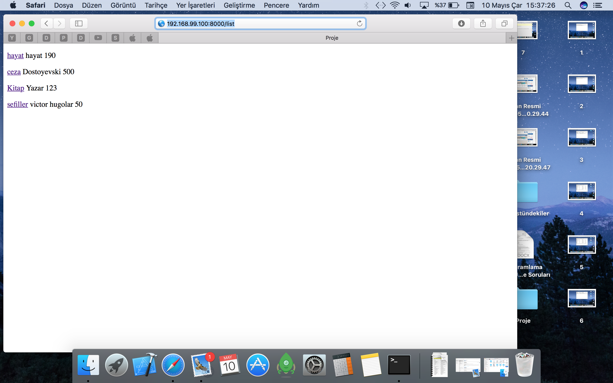
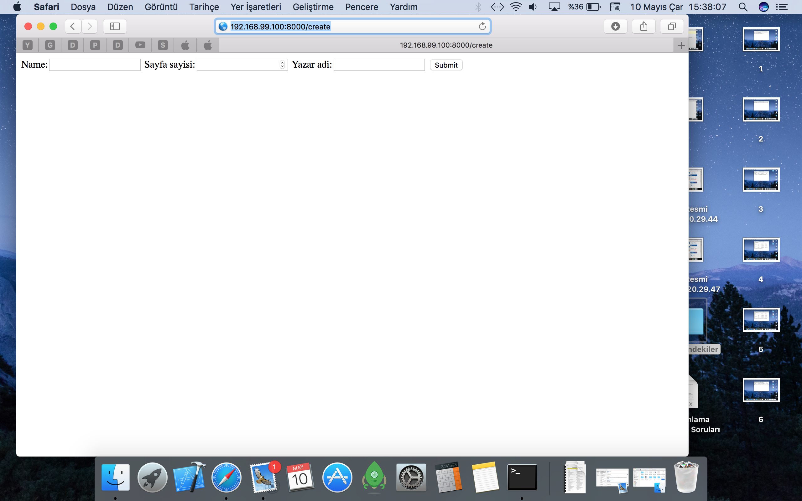
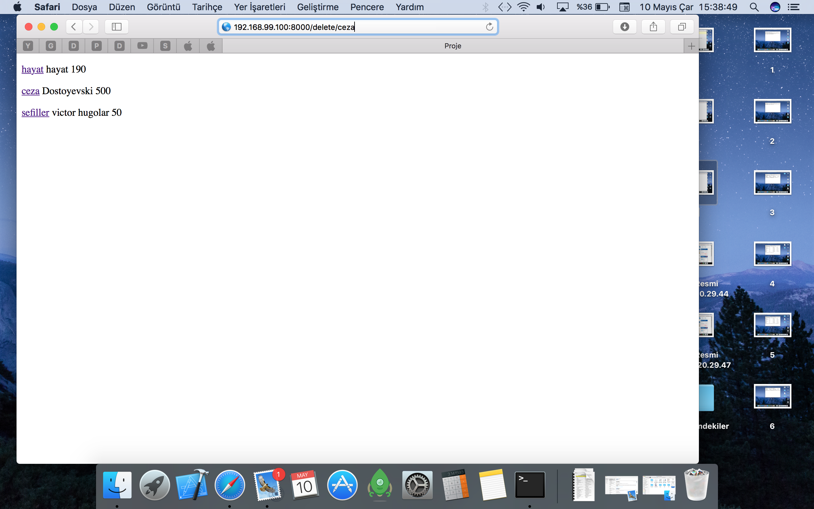

# Proje

# How to install 

- docker pull sumeyye1928/proje
- docker ps
- docker exec -u root -it <container_id> bash
- mongod
- it'll run in your container ip

# ScreenShots

- By using "docker pull sumeyye1928/proje", we're going to pull our images file.
# 

- By using "docker pull sumeyye1928/proje", we're going to pull our images file.
# 

- By using "docker pull sumeyye1928/proje", we're going to pull our images file.
# 

- By using "docker pull sumeyye1928/proje", we're going to pull our images file.
# 

- By using "docker pull sumeyye1928/proje", we're going to pull our images file.
# 

- By using "docker pull sumeyye1928/proje", we're going to pull our images file.
# 

- By using "docker pull sumeyye1928/proje", we're going to pull our images file.
# 

- By using "docker pull sumeyye1928/proje", we're going to pull our images file.
# 

- By using "docker pull sumeyye1928/proje", we're going to pull our images file.
# 

- By using "docker pull sumeyye1928/proje", we're going to pull our images file.
# 
